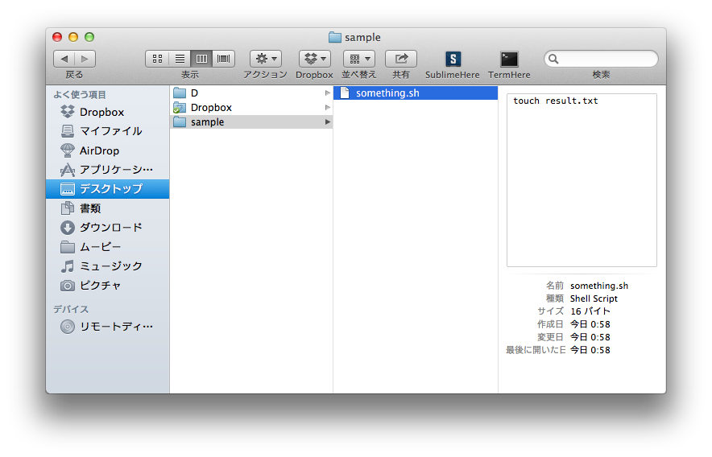
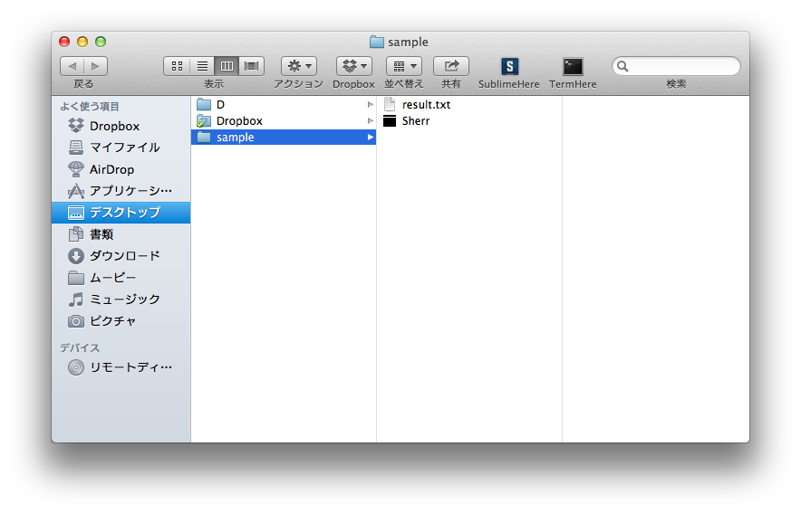

#Sherr

.sh runner-app for Mac.  
run .sh shell-script with double-click.

####Install
* clone this repo
* build with Xcode

or

* use /app/Sherr.app

####Usage
* open Sherr.app with right-click > Open package. will show "Contents" folder.
* drop YOUR-SHELLSCRIPT file on folder. inside of "Sherr.app".
* Double-click the Sherr.app will run your shell as same path.

#####e.g.
ready "something.sh" shell in "sample" folder

overview

add Sherr.app

move "something.sh" into Sherr.app

then run Sherr.app, something.sh will run which works as in the "sample" folder.

####Enable recursive-run from shell
Sherr can call recursively from shell.

	sh ./Sherr.app/Contents/Resources/continue.sh

* call with interval
* X times sequencial call

are enable.

####Renamable
you can rename "Sherr.app" to "Something.app".
	
	
####Limitation

* Only one *.sh in Sherr.app will be executed surely.
* Sherr.app will automatically shutdown in 10sec after Sherr.app finished executing the *.sh.
* If wanna modify this timelimit, open XcodeProject then change "resetSecondsValue".
* recursive-run works well for every active-Sherr.app. This means if there are 2 active Sherr.app in Mac and run continue.sh, every active-Sherr.app will run each shell. "run 1 Sherr.app in same time" is good.
